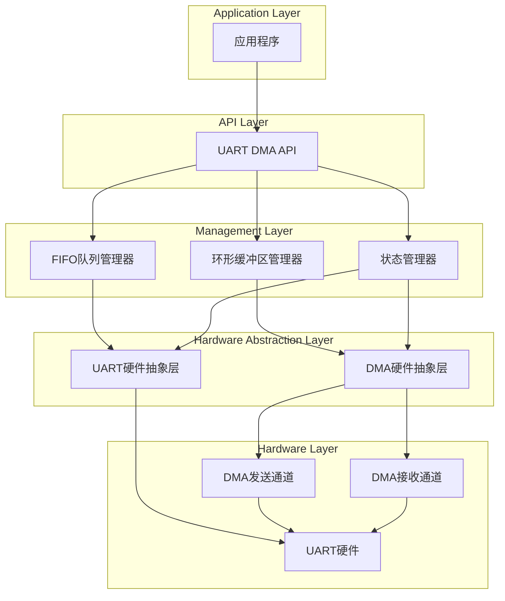
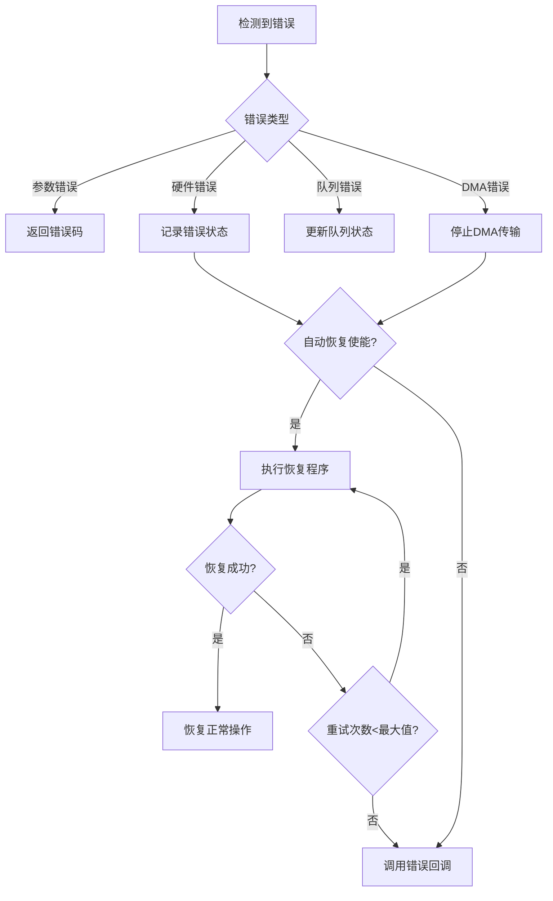

# Design Document

## Overview

本设计文档描述了基于GD32F350微控制器的UART DMA通信系统的详细架构。系统采用模块化设计，包含UART硬件抽象层、DMA管理模块、FIFO队列管理器和环形缓冲区实现。通过双DMA通道实现全双工通信，支持循环模式和高效的内存管理。

## Architecture

### 系统架构图



### 模块关系

- **API Layer**: 提供统一的用户接口
- **Management Layer**: 负责数据流管理和状态控制
- **HAL Layer**: 硬件抽象，屏蔽底层硬件细节
- **Hardware Layer**: GD32F350的UART和DMA硬件资源

## Components and Interfaces

### 1. UART DMA API模块

**职责**: 提供用户友好的API接口

**主要接口**:
```c
// 初始化和配置
uart_dma_error_t uart_dma_init(uart_dma_config_t* config);
uart_dma_error_t uart_dma_deinit(void);

// 发送接口
uart_dma_error_t uart_dma_send(const uint8_t* data, uint16_t length);
uart_dma_error_t uart_dma_send_async(const uint8_t* data, uint16_t length, uart_dma_callback_t callback);

// 接收接口
uart_dma_error_t uart_dma_receive(uint8_t* buffer, uint16_t length);
uart_dma_error_t uart_dma_receive_async(uint8_t* buffer, uint16_t length, uart_dma_callback_t callback);

// 状态查询
uart_dma_status_t uart_dma_get_tx_status(void);
uart_dma_status_t uart_dma_get_rx_status(void);
uint16_t uart_dma_get_tx_queue_count(void);
uint16_t uart_dma_get_rx_queue_count(void);

// 控制接口
uart_dma_error_t uart_dma_abort_tx(void);
uart_dma_error_t uart_dma_abort_rx(void);
uart_dma_error_t uart_dma_flush_tx_queue(void);
uart_dma_error_t uart_dma_flush_rx_queue(void);
```

### 2. FIFO队列管理器

**职责**: 管理发送和接收数据队列

**核心结构**:
```c
typedef struct {
    uint8_t* buffer;
    uint16_t head;
    uint16_t tail;
    uint16_t size;
    uint16_t count;
    bool is_full;
} fifo_queue_t;

typedef struct {
    fifo_queue_t tx_queue;
    fifo_queue_t rx_queue;
    uint8_t tx_buffer[TX_FIFO_SIZE];
    uint8_t rx_buffer[RX_FIFO_SIZE];
} uart_fifo_manager_t;
```

**主要功能**:
- 队列初始化和管理
- 数据入队和出队操作
- 队列状态查询
- 队列清空和重置

### 3. 环形缓冲区管理器

**职责**: 实现高效的循环缓冲机制

**核心结构**:
```c
typedef struct {
    uint8_t* buffer;
    uint16_t size;
    uint16_t write_index;
    uint16_t read_index;
    bool is_full;
} ring_buffer_t;

typedef struct {
    ring_buffer_t tx_ring;
    ring_buffer_t rx_ring;
    uint8_t tx_ping_buffer[PING_PONG_SIZE];
    uint8_t tx_pong_buffer[PING_PONG_SIZE];
    uint8_t rx_ping_buffer[PING_PONG_SIZE];
    uint8_t rx_pong_buffer[PING_PONG_SIZE];
    bool tx_using_ping;
    bool rx_using_ping;
} uart_ring_manager_t;
```

**主要功能**:
- 双缓冲区切换机制
- 循环模式数据处理
- 缓冲区溢出保护
- 自动缓冲区切换

### 4. DMA硬件抽象层

**职责**: 封装GD32F350 DMA操作

**核心配置**:
```c
typedef struct {
    uint32_t dma_periph;        // DMA外设 (DMA0)
    dma_channel_enum tx_channel; // 发送通道 (DMA_CH1)
    dma_channel_enum rx_channel; // 接收通道 (DMA_CH2)
    uint32_t tx_priority;       // 发送优先级
    uint32_t rx_priority;       // 接收优先级
    bool circular_mode;         // 循环模式使能
} uart_dma_hw_config_t;
```

**主要功能**:
- DMA通道配置和初始化
- 传输参数设置
- 中断处理程序
- 错误检测和恢复

### 5. UART硬件抽象层

**职责**: 封装GD32F350 UART操作

**核心配置**:
```c
typedef struct {
    uint32_t uart_periph;       // UART外设 (USART0/USART1)
    uint32_t baudrate;          // 波特率
    uint32_t word_length;       // 数据位
    uint32_t stop_bit;          // 停止位
    uint32_t parity;            // 校验位
    uint32_t hardware_flow;     // 硬件流控
} uart_hw_config_t;
```

## Data Models

### 1. 配置数据模型

```c
typedef struct {
    uart_hw_config_t uart_config;
    uart_dma_hw_config_t dma_config;
    uint16_t tx_fifo_size;
    uint16_t rx_fifo_size;
    uint16_t ping_pong_size;
    bool enable_circular_mode;
    bool enable_error_recovery;
} uart_dma_config_t;
```

### 2. 状态数据模型

```c
typedef enum {
    UART_DMA_STATUS_IDLE,
    UART_DMA_STATUS_BUSY,
    UART_DMA_STATUS_COMPLETE,
    UART_DMA_STATUS_ERROR,
    UART_DMA_STATUS_ABORTED
} uart_dma_status_t;

typedef enum {
    UART_DMA_ERROR_NONE,
    UART_DMA_ERROR_INVALID_PARAM,
    UART_DMA_ERROR_NOT_INITIALIZED,
    UART_DMA_ERROR_BUSY,
    UART_DMA_ERROR_QUEUE_FULL,
    UART_DMA_ERROR_QUEUE_EMPTY,
    UART_DMA_ERROR_DMA_ERROR,
    UART_DMA_ERROR_UART_ERROR,
    UART_DMA_ERROR_TIMEOUT
} uart_dma_error_t;
```

### 3. 统计数据模型

```c
typedef struct {
    uint32_t tx_bytes_total;
    uint32_t rx_bytes_total;
    uint32_t tx_packets_total;
    uint32_t rx_packets_total;
    uint32_t tx_errors;
    uint32_t rx_errors;
    uint32_t queue_overflows;
    uint32_t dma_errors;
} uart_dma_statistics_t;
```

## Error Handling

### 错误分类和处理策略

1. **参数错误**: 立即返回错误码，不影响系统状态
2. **硬件错误**: 记录错误，尝试恢复，必要时重新初始化
3. **队列错误**: 提供状态反馈，支持队列清空和重置
4. **DMA错误**: 停止传输，记录错误状态，支持重新启动

### 错误恢复机制

```c
typedef struct {
    bool auto_recovery_enabled;
    uint8_t max_retry_count;
    uint32_t recovery_timeout_ms;
    uart_dma_error_callback_t error_callback;
} uart_dma_error_config_t;
```

### 错误处理流程



## Testing Strategy

### 1. 单元测试

**测试范围**:
- FIFO队列操作
- 环形缓冲区管理
- DMA配置和控制
- UART参数设置
- 错误处理逻辑

**测试工具**: 使用Unity测试框架

### 2. 集成测试

**测试场景**:
- UART DMA发送功能
- UART DMA接收功能
- 全双工通信测试
- 循环模式测试
- 错误恢复测试

### 3. 性能测试

**测试指标**:
- 数据传输速率
- CPU占用率
- 内存使用效率
- 中断响应时间
- 队列处理延迟

### 4. 压力测试

**测试条件**:
- 连续高速数据传输
- 队列满载情况
- 多任务并发访问
- 长时间运行稳定性
- 异常情况处理

### 测试环境配置

```c
// 测试配置
#define TEST_UART_PERIPH    USART0
#define TEST_BAUDRATE       115200
#define TEST_DATA_SIZE      1024
#define TEST_LOOP_COUNT     1000
#define TEST_TIMEOUT_MS     5000

// 测试用例结构
typedef struct {
    char* test_name;
    void (*test_function)(void);
    bool expected_result;
} uart_dma_test_case_t;
```